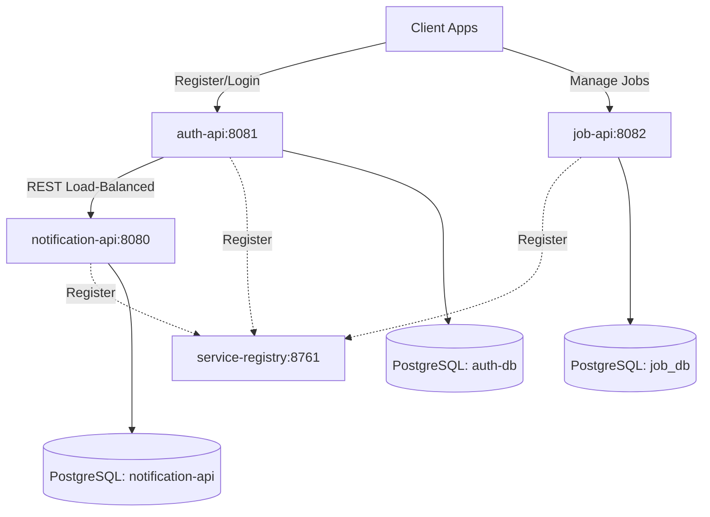

# JobTrack Microservices System

Welcome to the **JobTrack Microservices System**. This project is a backend suite designed to track job applications, handle user authentication securely, and send verification/notification emails. It is structured as a Maven multi-module project comprising multiple Spring Boot services configured as discovery clients under a centralized Spring Cloud Eureka service registry.

---

## 🏗️ Architecture & Component Overview

The project is split into four distinct microservices:



### 1. [service-registry](file:///c:/Users/nisha/OneDrive/Desktop/Spring-practice/jobtrack-microservices/service-registry) (Port: `8761`)
* **Role**: Service Discovery and Registry Server.
* **Technology**: Spring Cloud Netflix Eureka Server.
* **Details**: Serves as the central registry where all other microservices register themselves. It allows services to communicate with each other dynamically using service names instead of hardcoded hostnames/ports.

### 2. [auth-api](file:///c:/Users/nisha/OneDrive/Desktop/Spring-practice/jobtrack-microservices/auth-api) (Port: `8081`)
* **Role**: Handles user management and security.
* **Database**: PostgreSQL (`auth-db`)
* **Core Responsibilities**:
  * User Registration & Password Hashing.
  * Login Authentication & JWT Token Issuance.
  * Verification flow: Creates UUID-based verification tokens and registers verification requests with the `notification-api` via a `@LoadBalanced` `RestTemplate`.

### 3. [job-api](file:///c:/Users/nisha/OneDrive/Desktop/Spring-practice/jobtrack-microservices/job-api) (Port: `8082`)
* **Role**: Manages and tracks job application records.
* **Database**: PostgreSQL (`job_db`)
* **Core Responsibilities**:
  * Creating and updating job applications (tracking status like `SAVED`, `APPLIED`, `INTERVIEW`, `OFFERED`, `REJECTED`, `WITHDRAWN`).
  * **JWT Validation Filter**: Protects endpoints by extracting the JWT from the `Authorization` header, verifying the signature using a shared secret key, and binding the user's email context to Spring Security (`SecurityContextHolder`).

### 4. [notification-api](file:///c:/Users/nisha/OneDrive/Desktop/Spring-practice/jobtrack-microservices/notification-api) (Port: `8080`)
* **Role**: Asynchronous logging and sending of notifications.
* **Database**: PostgreSQL (`notification-api`)
* **Core Responsibilities**:
  * Exposes endpoints to receive and log verification notifications (e.g. `/api/v1/notify/user/send-verification`).
  * Utilizes `JavaMailSender` (SMTP configuration) and the `Thymeleaf` template engine to process HTML-based verification emails.

---

## 🛠️ Tech Stack & Frameworks

* **Language**: Java 17
* **Framework**: Spring Boot (v4.x/3.x parent configurations)
* **Cloud Infrastructure**: Spring Cloud 2025 (Netflix Eureka)
* **Security & Tokens**: Spring Security, JWT (io.jsonwebtoken JJWT)
* **Persistence**: Spring Data JPA, Hibernate, PostgreSQL Runtime Driver
* **Utilities & Templating**: Lombok, Thymeleaf, Spring Boot Starter Mail, Spring Validation
* **Build System**: Maven (Multi-module structure)

---

## 🔐 Authentication & Security Flow

1. **User Sign Up / Login**: User sends credentials to `auth-api`.
2. **Token Generation**: Upon verification, `auth-api` returns a JSON Web Token (JWT) signed with a secret key.
3. **API Requests**: The client includes the token in subsequent headers: `Authorization: Bearer <token>`.
4. **Validation**: `job-api` interceptor (`AuthFilter`) extracts and validates the token locally without calling `auth-api` database. It verifies the signature and maps the payload user email into the request context.

---

## ⚙️ Setup and Installation

### 1. Database Configuration
Ensure PostgreSQL is running locally on port `5432` and create three databases:
```sql
CREATE DATABASE "auth-db";
CREATE DATABASE "job_db";
CREATE DATABASE "notification-api";
```
Ensure your postgres credentials match the configurations in each service's `application.properties` (Default username/password: `postgres`/`postgres`).

### 2. Environment Variables
To enable email notifications, configure the SMTP environment variables for `notification-api`:
* `MAIL_USERNAME`: Your SMTP/Gmail address
* `MAIL_PASSWORD`: Your SMTP/Gmail App Password

### 3. Startup Order
Run the microservices in the following order:
1. **`service-registry`**: Let it initialize on port `8761`.
2. **`auth-api`**, **`job-api`**, and **`notification-api`**: Once running, verify they are registered on the Eureka Dashboard at [http://localhost:8761](http://localhost:8761).

---

## 📂 Structural Note
* **Redundant Root `src`**: The directory root contains a `src/` folder (with `ServiceRegistryApplication.java`). Since the root `pom.xml` uses `<packaging>pom</packaging>` and references modular subdirectories, this root `src/` folder is redundant and unused.
